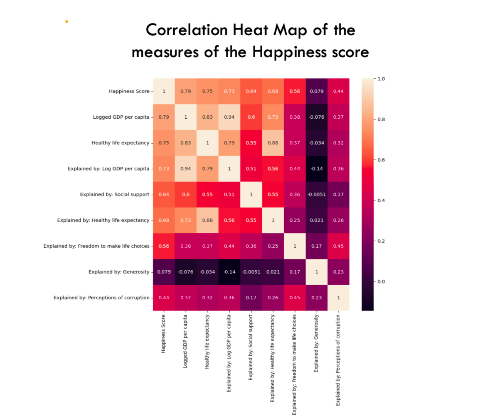

<h2>Objective</h2>

Each year, the Gallup World Poll surveys adult citizens in nearly 160 countries and consists of over 100 global and region-specific questions to calculat the Happiness score of each country. A lot has changed globally since 2020 and led to a lot of uncertainty. Therefore we analysis the data to find out if the happiness score has changed between 2015 and 2023. 

		<article>
			
			

				<h3>Data</h3>
				
World Happiness Reports 2015 -2023 published by the Sustainable Developement Solutions Network 

			

		</article>
		<article>
			
			

				<h3>Techniques applied</h3>
				
 Linear Regression, Cluster Analysis, Spatial Analysis, Phython & Tableau Visualization 

			

		</article>
	

<!-- Section -->
<section>

<h2>Tools</h2>

</section>
<!-- Section -->
<section>
	

	<h2>Analysis</h2>

	<article>
			

				<h3>Key Questions</h3>
				
Which social factors have the highest impact on the Happiness scores over the years?

				<h3>Results</h3>
				
The correlation heat map shows that the logged GPD per capita has the highest impact on the
			           happiness score of a country.

			

		</article>
  		<article>
			
		</article>
  

	<article>
			

				<h3>Key Questions</h3>
				
Which social factors have the highest impact on the Happiness scores over the years?

				<h3>Results</h3>
				
The correlation heat map shows that the logged GPD per capita has the highest impact on the
			           happiness score of a country.

			

		</article>
  		<article>
			
		</article>
		
