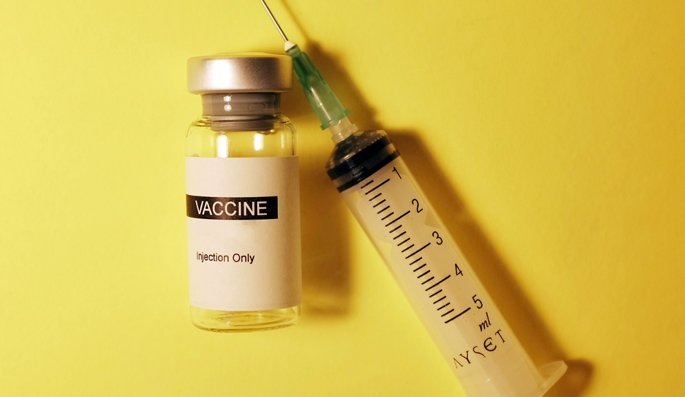

<!-- Section -->
<section>
	<header class="major">
		<h2>How can I help?</h2>
	</header>
	

		<article>
			
			

				<h3>Analytical skills</h3>
				
 Data Mining,
				Data Cleaning,
				Data Wrangling,
				Data Merging,
				Descriptive Analysis,
				Deriving Variables,
				Data Visualization,
				Data storytelling

			

		</article>
		<article>
			
			

				<h3>Tools</h3>
				
SQL,
				Python,
				Tableau,
				Excel

			

		</article>
		<article>
			
			

				<h3>Competences</h3>
				
 Problem solver, 
				Critical thinker,
				Focused and conscientious,
				Avid learner

			

		</article>
		<article>
			
			

				<h3>Goals</h3>
				
I aim to expand my professional experience especially by working in a team and gain a higher level of professional competence in the field of data visualization.

			

		</article>
	

</section>

<!-- Section -->
<section>
	<header class="major">
		<h2>Portfolio</h2>
	</header>
	

		<article>
			
			<h3>World Happiness (2015-2023)</h3>
			
Each year, the Gallup World Poll surveys adult citizens in nearly 160 countries and consists of over 100 global and region-specific questions to calculat the Happiness score of each country. I analysed the open source data to find out if the happiness score has changed between 2015 and 2023.

			<ul class="actions">
				<li><a href="{{ 'Happiness.html' | absolute_url }}" class="button">More</a></li>
			</ul>
		</article>
		<article>
			
			<h3>Instacart</h3>
			
Instacart, an online grocery store that operates through an app, that wanted to uncover more information about their sales patterns.Therefore I analysed the existing data in order to derive insights and suggest strategies for better segmentation based on the provided criteria.

			<ul class="actions">
				<li><a href="{{ 'Instacart.html' | absolute_url }}" class="button">More</a></li>
			</ul>
		</article>
		<article>
			
			<h3>Rockbuster</h3>
			
Rockbuster Stealth LLC is a movie rental company that wanted to launch an online video rental service in order to stay competitive. analysed the existing data to help with the launch strategy for the new online video services for 2020. 

			<ul class="actions">
				<li><a href="{{ 'Rockbuster.html' | absolute_url }}" class="button">More</a></li>
			</ul>
		</article>
		<article>
			
			<h3>Influenza season in the USA </h3>
			
A medical staffing agency wanted to provide temporary workers to clinics and hospitals on an as-needed basis. Therefore I analyzed the flu trends in the USA in order to provide more accurate recommendations on how many workers to send to each state. 

			<ul class="actions">
				<li><a href="{{ 'Influenza.html' | absolute_url }}" class="button">More</a></li>
			</ul>
		</article>
		<article>
			
			<h3>GameCo</h3>
			
The video game company GameCo wanted to inform the developement and marketing of new games.  performed descriptive analysis to gain insights into the current video game landscape for a marketing and sales’team planning für 2017.

			<ul class="actions">
				<li><a href="{{ 'GameCo.html' | absolute_url }}" class="button">More</a></li>
			</ul>
		</article>
		<article>
			
			<h3>PIG E. Bank</h3>
			
The PIG E. Bank wanted to understand the factors behind them losing clients. I used a data mining mechanism, build a decision tree to predict which clients might leave the bank.

			<ul class="actions">
				<li><a href="{{ 'Pigebank.html' | absolute_url }}" class="button">More</a></li>
			</ul>
		</article>
	

</section>
